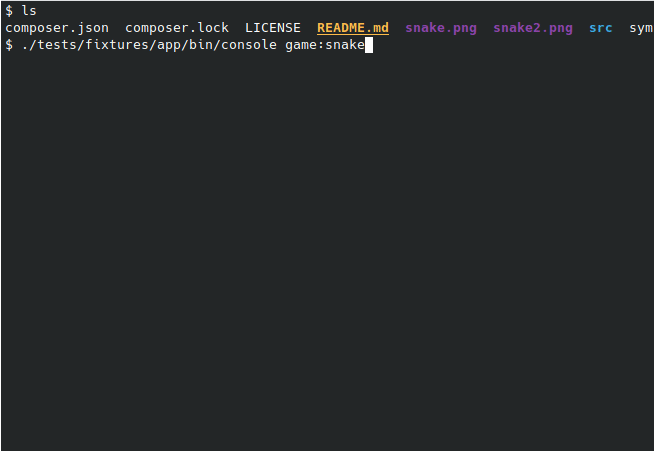

                                 /^\/^\
                               _|__|  O|
                      \/     /~     \_/ \
                       \____|__________/  \
                             \_______      \
                                     `\     \                    \
                                      |     |                     \
     ____              _             /     /                       \
    / ___| _ __   __ _| | _____     /     /                         \\
    \___ \| '_ \ / _` | |/ / _ \   /     /                           \ \
     ___) | | | | (_| |   <  __/  /     /                             \  \
    |____/|_| |_|\__,_|_|\_\___| /     /             _----_            \   \
                                /     /           _-~      ~-_         |   |
                               (      (        _-~    _--_    ~-_     _/   |
                                \      ~-____-~    _-~    ~-_    ~-_-~    /
                                  ~-_           _-~          ~-_       _-~   - jurcy -
                                     ~--______-~                ~-___-~

A command line snake game implemented in PHP.

This demonstrates the `cursor` control provided by the Symfony Console.
Let it not distract you from your work ;-)

The application is provided as a stand-alone .phar file with the help of `humbug/box`.

# Installation and Usage
                          
## Installation

    wget https://github.com/dbu/php-snake/releases/latest/download/php-snake.phar
    chmod u+x php-snake.phar

## Run

    ./php-snake.phar

# Development

Clone the git repository, then run:

    composer install
    ./bin/console

## Create the .phar file

    make dist

## Code Quality

    make cs
    # to fix code style issues automatically
    make fix-cs

# FAQ

## My console is looking weird after running the command

This can happen after aborting the program, e.g. with <ctrl>-c. Reset the console to sane defaults
by typing:

    stty sane

Be aware that input is probably hidden, so you won't see anything until you hit enter.

## Why Snake?

Because it was the first thing I could think of. 
And its simple enough that it should be possible to follow what is going on.

## What is this font?

Delta Corps Priest 1 from http://patorjk.com/software/taag/

# Screenshots

